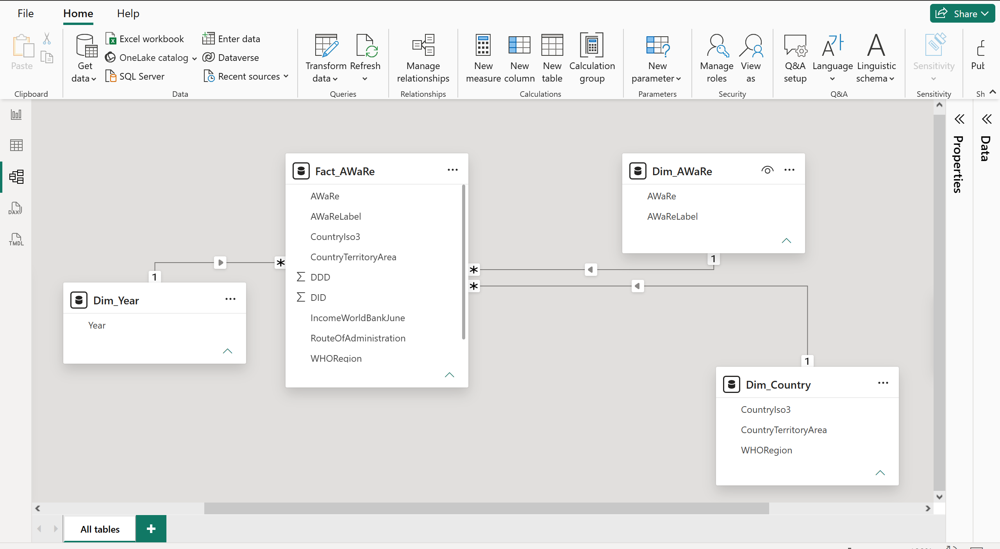
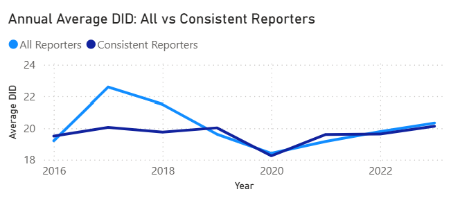

# WHO GLASS Antibiotic Consumption Dashboard

## Project Overview

This project presents an interactive Power BI dashboard analysing antimicrobial consumption data reported through the World Health Organization (WHO) Global Antimicrobial Resistance and Use Surveillance System (GLASS) from 2016–2023.

The dashboard examines antibiotic consumption using Defined Daily Doses (DDD) and DID (DDD per 1,000 inhabitants per day), explores antibiotic distribution across the WHO AWaRe categories, compares consumption patterns across countries and WHO regions, and assesses country performance against the current ≥70% Access target. 
> **Target note:** The current ≥70% Access target for 2030 is used as a benchmark to compare country-level Access antibiotic consumption reported between 2016 and 2023.

Antimicrobial resistance (AMR) is a major public health challenge globally, and monitoring antimicrobial consumption is an important part of antimicrobial stewardship.

The project aimed to explore:

- antibiotic consumption patterns over time;
- differences between countries and WHO regions;
- Access, Watch and Reserve antibiotic consumption;
- country performance against the current ≥70% Access target; and
- changes in the number of countries contributing data over time.

The analysis also includes validation checks to account for differences in reporting coverage and to ensure that DID is aggregated at the appropriate country-year level.

## Dashboard Preview
The interactive dashboard summarizes reporting coverage, AWaRe antibiotic distribution, country and regional consumption patterns, temporal trends in DID, and performance against the current ≥70% Access target.

Users can filter the dashboard by country and year to explore changes in antibiotic consumption and AWaRe composition.


## Analytical Questions

The analysis was designed to answer the following questions:

- How has antibiotic consumption changed across reporting countries between 2016 and 2023?
- How does antibiotic consumption vary across countries and WHO regions?
- What proportion of reported antibiotic consumption falls within the Access, Watch and Reserve (AWaRe) categories?
- Which countries meet the current target of at least 70% of total antibiotic consumption coming from the Access category?
- How has the number of countries reporting antimicrobial consumption data changed over time?
- To what extent do changes in reporting coverage affect observed trends in antibiotic consumption?

## Data Source & Structure

**Primary data source:** [WHO Global Antimicrobial Resistance and Use Surveillance System (GLASS) – Data Visualization Dashboard](https://worldhealthorg.shinyapps.io/glass-dashboard/)

The analysis uses antimicrobial use data reported through the World Health Organization (WHO) Global Antimicrobial Resistance and Use Surveillance System (GLASS-AMU).

The dataset analysed in this project covers **2016–2023** and contains data for **73 reporting countries and territories** across the six WHO regions. Reporting coverage varies by year, increasing from 36 countries in 2016 to 65 in 2023.

### Key Variables

The analysis focuses on:

- **Country/Territory** – reporting country or territory.
- **Year** – reporting year from 2016 to 2023.
- **WHO Region** – geographical region assigned by WHO.
- **DDD (Defined Daily Dose)** – a standardised unit used to measure antibiotic consumption.
- **DID** – Defined Daily Doses per 1,000 inhabitants per day, allowing consumption to be compared between populations.
- **AWaRe Category** – WHO classification of antibiotics into Access, Watch and Reserve groups, with additional records under the Other/Not Classified category.

### Reporting Coverage

Not all countries reported data in every year. The number of reporting countries increased over the study period:

| Year | Reporting Countries |
|------|---------------------|
| 2016 | 36 |
| 2017 | 42 |
| 2018 | 44 |
| 2019 | 50 |
| 2020 | 53 |
| 2021 | 60 |
| 2022 | 64 |
| 2023 | 65 |

The difference in reporting coverage was considered when interpreting temporal trends, and additional sensitivity analyses were conducted using countries with complete reporting across the study period.

## Data Preparation & Modelling

The source data was prepared in Power Query before analysis. The main preparation steps included promoting column headers, assigning appropriate data types, renaming fields for clarity, and removing variables that were not required for the analysis.

The prepared data was then organised into a star-schema model in Power BI. This separated the antimicrobial consumption records from the main descriptive dimensions and provided a structured model for filtering and DAX calculations.

The model consists of:

- **Fact_AWaRe** – the central fact table containing antibiotic consumption records, including DDD and DID.
- **Dim_Country** – country-level information including country/territory, ISO3 code and WHO region.
- **Dim_Year** – unique reporting years used for temporal analysis.
- **Dim_AWaRe** – AWaRe classifications used to analyse Access, Watch, Reserve, and other/not-classified categories.

One-to-many relationships connect each dimension table to `Fact_AWaRe`, with filtering flowing from the dimension tables to the central fact table.

### Data Model



## DAX Measures & Analytical Logic

DAX measures were developed to calculate antibiotic consumption, AWaRe distribution, reporting coverage, and country performance against the 70% Access target.

### Total Antibiotic Consumption

Total Defined Daily Doses (DDD) were calculated from the fact table:

```DAX
Total DDD =
SUM(Fact_AWaRe[DDD])
```

DID was also aggregated across the relevant consumption records:

```DAX
Total DID =
SUM(Fact_AWaRe[DID])
```

### AWaRe Distribution

Access consumption was calculated by filtering total DDD to antibiotics classified in the Access category:

```DAX
Access DDD =
CALCULATE(
    [Total DDD],
    Dim_AWaRe[AWaRe] = "A"
)
```

The proportion of total consumption represented by Access antibiotics was then calculated as:

```DAX
Access % =
DIVIDE([Access DDD], [Total DDD])
```

Equivalent measures were created for Watch, Reserve, and other/not-classified antibiotics.

### Mean Annual DID

Because countries reported data for different numbers of years, mean annual DID was calculated across the available reporting years for each country:

```DAX
Mean Annual DID =
AVERAGEX(
    VALUES(Dim_Year[Year]),
    CALCULATE([Total DID])
)
```

This measure is used for country comparisons across the full study period rather than simply summing DID across multiple years.

### 70% Access Target

Country performance against the current 70% Access target was classified using the calculated Access proportion:

```DAX
WHO Target Status =
IF(
    ISBLANK([Access %]),
    BLANK(),
    IF(
        [Access %] >= 0.70,
        "✓ Meets Target",
        "✕ Below Target"
    )
)
```

Blank values were excluded from target classification to avoid treating countries without applicable observations as being below the target.

### DID Aggregation Validation

During validation, an initial row-level average of DID was found to be inappropriate because individual country-year observations were represented by multiple consumption records.

For example, validation of the United Kingdom's 2023 data showed that averaging the component-level DID records produced approximately **1.07 DID**, whereas aggregating the records at the country-year level produced approximately **17.08 DID**.

The calculation approach was therefore revised so that DID is first aggregated within the relevant country-year context before annual or cross-country averages are calculated.

This validation step prevented component-level records from being incorrectly interpreted as independent country-level consumption estimates.

## Key Findings

### 1. Access antibiotics accounted for just over half of reported consumption

Across the pooled 2016–2023 dataset, **54.8%** of reported antibiotic consumption was classified as Access, compared with **42.6% Watch** and **0.2% Reserve**. The remaining consumption falls outside the three main AWaRe categories.

This pooled distribution is DDD-weighted across the available observations and should not be interpreted as the average percentage for an individual country.

### 2. Average country-level DID varied over time

Average country DID increased from **19.2 in 2016** to **22.6 in 2017**, before declining to **18.4 in 2020**. It subsequently increased to **20.3 in 2023**.

Because the number and composition of reporting countries changed over time, these annual values should not automatically be interpreted as changes in antibiotic consumption within the same group of countries.

### 3. Reporting coverage increased substantially

The number of countries and territories contributing data increased from **36 in 2016** to **65 in 2023**.

A sensitivity analysis using countries with consistent reporting across all eight years showed a more stable early-period trend than the analysis using all available reporters. However, both series showed a decline around 2020 followed by an increase towards 2023.

This suggests that changes in reporting composition contribute to some of the variation observed in the overall annual trend.

### 4. Substantial regional variation was observed

Mean annual DID varied across WHO regions:

| WHO Region | Mean Annual DID |
|---|---:|
| Eastern Mediterranean | 25.5 |
| South-East Asia | 24.5 |
| Africa | 19.9 |
| Europe | 17.9 |
| Western Pacific | 16.3 |
| Region of the Americas | 12.9 |

These comparisons describe consumption among countries represented in the dataset and should be interpreted in the context of differences in reporting coverage between regions and years.

### 5. Country-level consumption varied considerably

Across the available reporting periods, several countries had substantially higher mean annual DID than the overall distribution. The highest values in the analysis included **Iran (61.3)**, **Nepal (48.6)** and the **United Republic of Tanzania (48.1)**.

These results describe reported consumption and do not by themselves indicate inappropriate antibiotic use, as differences may reflect population health needs, healthcare systems, data coverage, and reporting practices.

### 6. A minority of reporting countries met the current 70% Access benchmark

Using the current ≥70% Access target as a benchmark, **22 of 65 reporting countries (33.8%)** met the threshold in 2023.

Across the full dataset, **26 of 73 countries and territories (35.6%)** met the benchmark when their available 2016–2023 observations were pooled.

The proportion meeting the benchmark varied over time, from **30.6% in 2016** to **33.8% in 2023**, rather than showing a consistent year-on-year increase.

## Data Quality, Validation & Sensitivity Analysis

Several validation checks were performed to ensure that the dashboard calculations reflected the structure of the underlying GLASS-AMU data.

### DID Aggregation

The source data contains multiple consumption records within individual country-year observations. An initial row-level average of DID therefore produced misleading country-level estimates.

Country-year validation was used to identify this issue, and the analytical approach was revised to aggregate DID within the appropriate country-year context before calculating annual, country, and regional summaries.

### AWaRe Validation

AWaRe percentages were checked to ensure that Access, Watch, Reserve, and other/not-classified categories reconciled with total reported consumption.

For example, validation of the United Kingdom's 2023 observations produced approximately:

- **Access:** 72.4%
- **Watch:** 27.1%
- **Reserve:** 0.4%

The categories reconciled to approximately 100% after accounting for rounding and other/not-classified consumption.

### Reporting Coverage

Reporting coverage was not constant across the study period. The number of reporting countries and territories increased from **36 in 2016** to **65 in 2023**.

This means that changes in the overall annual DID series can reflect both:

1. changes in antibiotic consumption; and
2. changes in the countries contributing data in a given year.

The annual trend was therefore interpreted as an average among countries reporting in each year rather than as a fixed-panel global trend.

### Consistent-Reporter Sensitivity Analysis

A sensitivity analysis identified **33 countries** with observations in all eight years from 2016 to 2023.

Annual average DID among these consistent reporters was compared with the corresponding series using all available reporting countries.

The consistent-reporter series was more stable during the earlier years, suggesting that changes in reporting composition contributed to some of the variation in the all-reporter trend. However, both series showed a decline around 2020 followed by an increase towards 2023.



This analysis provided an additional check on whether the main temporal pattern was driven primarily by changes in country participation.

### 70% Access Target Validation

Countries were classified as meeting the current Access benchmark only where an Access percentage was available.

Blank observations were explicitly excluded from the classification to prevent countries without applicable data from being incorrectly counted as below target.

As a final reconciliation check, the number of countries meeting and below the benchmark was compared with the number of reporting countries for each year. For example, in 2023:

**22 meeting target + 43 below target = 65 reporting countries.**

## Limitations

Several limitations should be considered when interpreting the results:

- **Changing reporting coverage:** The number and composition of reporting countries varied between years. Annual estimates therefore represent countries reporting in each year rather than a fixed panel of countries.

- **Differences in national data coverage:** GLASS-AMU submissions may differ in population coverage, healthcare sectors, data sources, and completeness between countries. Direct country and regional comparisons should therefore be interpreted with caution.

- **Consumption does not measure appropriateness:** Higher DID indicates greater reported antibiotic consumption but does not, by itself, demonstrate inappropriate prescribing or use. Differences may reflect disease burden, healthcare access, prescribing practices, and characteristics of national surveillance systems.

- **Aggregated data:** The analysis uses country-level surveillance data and cannot assess individual prescribing decisions, patient-level antibiotic exposure, or clinical appropriateness.

- **AWaRe classification:** A small proportion of reported consumption falls outside the main Access, Watch and Reserve categories, meaning these three groups do not always account for exactly 100% of consumption.

- **70% Access target:** The current ≥70% Access target for 2030 is applied as a benchmark to the 2016–2023 observations. It was not the applicable target throughout the full period covered by the dataset.

These limitations were considered when interpreting the dashboard, particularly the temporal, country, and regional comparisons.

## Tools & Skills Demonstrated

### Tools

- **Power BI** – dashboard development, interactive filtering and data visualisation
- **Power Query** – data preparation, column selection, data-type management and field standardisation
- **DAX** – development of measures for DDD, DID, AWaRe proportions, reporting coverage, annual averages and target classification

### Data & Analytical Skills

- Star-schema data modelling
- Fact and dimension table design
- One-to-many relationship management
- Context-aware DAX calculations
- Antimicrobial consumption surveillance
- AWaRe antibiotic classification analysis
- Country and regional comparative analysis
- Temporal trend analysis
- Data-quality validation and reconciliation
- Sensitivity analysis for changing reporting coverage
- Interpretation of surveillance data and analytical limitations

### Key Analytical Challenge

A key challenge in the project was ensuring that calculations respected the grain of the underlying surveillance data. Validation showed that directly averaging component-level DID records produced misleading country-level estimates.

The analysis was therefore redesigned to aggregate DID within the appropriate country-year context before calculating annual, country, and regional summaries.

A second challenge was the changing composition of reporting countries over time. This was addressed through a sensitivity analysis comparing annual DID among all available reporters with a fixed group of countries reporting consistently across 2016–2023.

### Power BI File

The Power BI (.pbix) project file is available on request for portfolio review.

## Author

**Dashe Gwotyet**

Veterinary Epidemiologist | Surveillance Data Analyst | One Health & AMR

Background in veterinary medicine, infectious disease epidemiology, antimicrobial resistance, and health data analysis.

[LinkedIn](https://www.linkedin.com/in/dashegwotyet) | [GitHub](https://github.com/Gwotyet)
