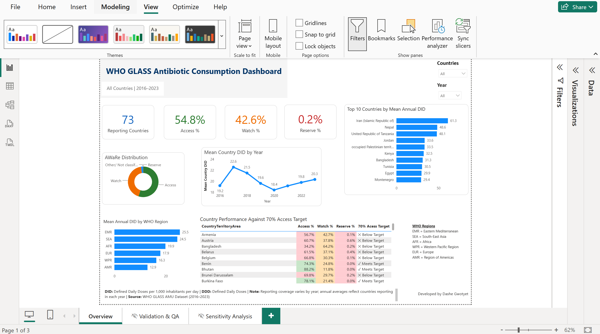

# WHO GLASS Antibiotic Consumption Dashboard

## Project Overview

This project presents an interactive Power BI dashboard analysing antimicrobial consumption data reported through the World Health Organization (WHO) Global Antimicrobial Resistance and Use Surveillance System (GLASS) from 2016–2023.

The dashboard examines antibiotic consumption using Defined Daily Doses (DDD) and DID (DDD per 1,000 inhabitants per day), explores antibiotic distribution across the WHO AWaRe categories, compares consumption patterns across countries and WHO regions, and assesses country performance against the WHO 60% Access benchmark.

Antimicrobial resistance (AMR) is a major public health challenge globally, and monitoring antimicrobial consumption is an important part of antimicrobial stewardship.

The project aimed to explore:

- antibiotic consumption patterns over time;
- differences between countries and WHO regions;
- Access, Watch and Reserve antibiotic consumption;
- country performance against the WHO 60% Access benchmark; and
- changes in the number of countries contributing data over time.

The analysis also includes validation checks to account for differences in reporting coverage and to ensure that DID is aggregated at the appropriate country-year level.

## Dashboard Preview
The interactive dashboard provides a summary of reporting coverage, AWaRe antibiotic distribution, country and regional consumption patterns, temporal trends in DID, and performance against the WHO 60% Access benchmark.

Users can filter the dashboard by country and year to explore changes in antibiotic consumption and AWaRe composition.

